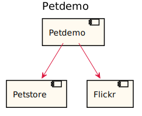
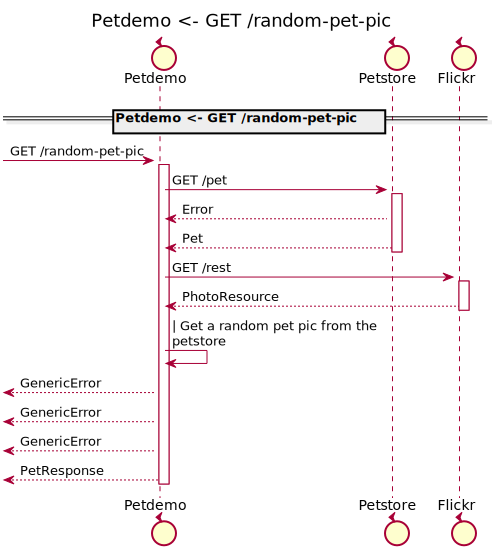
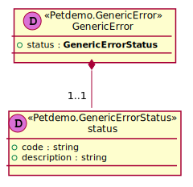
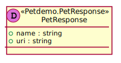
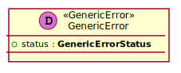
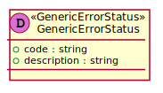

[Back](../README.md)

# Petdemo

## Integration Diagram

## Application Index

| Application Name | Method | Source Location |
|----|----|----|
| Petdemo | [GET /random-pet-pic](#Petdemo-GETrandom-pet-pic) | [https://github.com/anz-bank/sysl-template/blob/master/specs/frontend/petdemo/petdemo.yaml](https://github.com/anz-bank/sysl-template/blob/master/specs/frontend/petdemo/petdemo.yaml)|  

## Type Index

| Application Name | Type Name | Source Location |
|----|----|----|
| Petdemo | [GenericError](#Petdemo.GenericError) | [https://github.com/anz-bank/sysl-template/blob/master/specs/frontend/petdemo/petdemo.yaml](https://github.com/anz-bank/sysl-template/blob/master/specs/frontend/petdemo/petdemo.yaml)|
| Petdemo | [GenericErrorStatus](#Petdemo.GenericErrorStatus) | [https://github.com/anz-bank/sysl-template/blob/master/specs/frontend/petdemo/petdemo.yaml](https://github.com/anz-bank/sysl-template/blob/master/specs/frontend/petdemo/petdemo.yaml)|
| Petdemo | [PetResponse](#Petdemo.PetResponse) | [https://github.com/anz-bank/sysl-template/blob/master/specs/frontend/petdemo/petdemo.yaml](https://github.com/anz-bank/sysl-template/blob/master/specs/frontend/petdemo/petdemo.yaml)|

# Applications

## Application Petdemo

- Pet service to demo the sysl codegen capabilties.

### Petdemo GET /random-pet-pic

Sequence Diagram

Request types

No Request types

Response types

---

# Types

Petdemo.GenericError

### Petdemo.GenericError

[Full Diagram](Petdemo/genericerror.svg)

#### Fields

| Field name | Type | Description |
|----|----|----|
| status | GenericErrorStatus | |

Petdemo.GenericErrorStatus

### Petdemo.GenericErrorStatus

[Full Diagram](Petdemo/genericerrorstatus.svg)

#### Fields

| Field name | Type | Description |
|----|----|----|
| code | string | |
| description | string | |

Petdemo.PetResponse

### Petdemo.PetResponse

[Full Diagram](Petdemo/petresponse.svg)

#### Fields

| Field name | Type | Description |
|----|----|----|
| name | string | |
| uri | string | |

