[Back](../README.md)

# flickr

## Integration Diagram
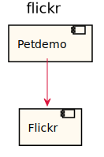

## Application Index

| Application Name | Method | Source Location |
|----|----|----|
| Flickr | [GET /rest](#Flickr-GETrest) | [https://github.com/anz-bank/sysl-template/blob/master/specs/backend/flickr/flickr.yaml](https://github.com/anz-bank/sysl-template/blob/master/specs/backend/flickr/flickr.yaml)|  

## Type Index

| Application Name | Type Name | Source Location |
|----|----|----|
| Flickr | [Note](#Flickr.Note) | [https://github.com/anz-bank/sysl-template/blob/master/specs/backend/flickr/flickr.yaml](https://github.com/anz-bank/sysl-template/blob/master/specs/backend/flickr/flickr.yaml)|
| Flickr | [Owner](#Flickr.Owner) | [https://github.com/anz-bank/sysl-template/blob/master/specs/backend/flickr/flickr.yaml](https://github.com/anz-bank/sysl-template/blob/master/specs/backend/flickr/flickr.yaml)|
| Flickr | [Photo](#Flickr.Photo) | [https://github.com/anz-bank/sysl-template/blob/master/specs/backend/flickr/flickr.yaml](https://github.com/anz-bank/sysl-template/blob/master/specs/backend/flickr/flickr.yaml)|
| Flickr | [PhotoResource](#Flickr.PhotoResource) | [https://github.com/anz-bank/sysl-template/blob/master/specs/backend/flickr/flickr.yaml](https://github.com/anz-bank/sysl-template/blob/master/specs/backend/flickr/flickr.yaml)|
| Flickr | [Photo_comments](#Flickr.Photo_comments) | [https://github.com/anz-bank/sysl-template/blob/master/specs/backend/flickr/flickr.yaml](https://github.com/anz-bank/sysl-template/blob/master/specs/backend/flickr/flickr.yaml)|
| Flickr | [Photo_dates](#Flickr.Photo_dates) | [https://github.com/anz-bank/sysl-template/blob/master/specs/backend/flickr/flickr.yaml](https://github.com/anz-bank/sysl-template/blob/master/specs/backend/flickr/flickr.yaml)|
| Flickr | [Photo_description](#Flickr.Photo_description) | [https://github.com/anz-bank/sysl-template/blob/master/specs/backend/flickr/flickr.yaml](https://github.com/anz-bank/sysl-template/blob/master/specs/backend/flickr/flickr.yaml)|
| Flickr | [Photo_editability](#Flickr.Photo_editability) | [https://github.com/anz-bank/sysl-template/blob/master/specs/backend/flickr/flickr.yaml](https://github.com/anz-bank/sysl-template/blob/master/specs/backend/flickr/flickr.yaml)|
| Flickr | [Photo_notes](#Flickr.Photo_notes) | [https://github.com/anz-bank/sysl-template/blob/master/specs/backend/flickr/flickr.yaml](https://github.com/anz-bank/sysl-template/blob/master/specs/backend/flickr/flickr.yaml)|
| Flickr | [Photo_people](#Flickr.Photo_people) | [https://github.com/anz-bank/sysl-template/blob/master/specs/backend/flickr/flickr.yaml](https://github.com/anz-bank/sysl-template/blob/master/specs/backend/flickr/flickr.yaml)|
| Flickr | [Photo_permissions](#Flickr.Photo_permissions) | [https://github.com/anz-bank/sysl-template/blob/master/specs/backend/flickr/flickr.yaml](https://github.com/anz-bank/sysl-template/blob/master/specs/backend/flickr/flickr.yaml)|
| Flickr | [Photo_publiceditability](#Flickr.Photo_publiceditability) | [https://github.com/anz-bank/sysl-template/blob/master/specs/backend/flickr/flickr.yaml](https://github.com/anz-bank/sysl-template/blob/master/specs/backend/flickr/flickr.yaml)|
| Flickr | [Photo_tags](#Flickr.Photo_tags) | [https://github.com/anz-bank/sysl-template/blob/master/specs/backend/flickr/flickr.yaml](https://github.com/anz-bank/sysl-template/blob/master/specs/backend/flickr/flickr.yaml)|
| Flickr | [Photo_title](#Flickr.Photo_title) | [https://github.com/anz-bank/sysl-template/blob/master/specs/backend/flickr/flickr.yaml](https://github.com/anz-bank/sysl-template/blob/master/specs/backend/flickr/flickr.yaml)|
| Flickr | [Photo_urls](#Flickr.Photo_urls) | [https://github.com/anz-bank/sysl-template/blob/master/specs/backend/flickr/flickr.yaml](https://github.com/anz-bank/sysl-template/blob/master/specs/backend/flickr/flickr.yaml)|
| Flickr | [Photo_usage](#Flickr.Photo_usage) | [https://github.com/anz-bank/sysl-template/blob/master/specs/backend/flickr/flickr.yaml](https://github.com/anz-bank/sysl-template/blob/master/specs/backend/flickr/flickr.yaml)|
| Flickr | [Photo_visibility](#Flickr.Photo_visibility) | [https://github.com/anz-bank/sysl-template/blob/master/specs/backend/flickr/flickr.yaml](https://github.com/anz-bank/sysl-template/blob/master/specs/backend/flickr/flickr.yaml)|
| Flickr | [Tag](#Flickr.Tag) | [https://github.com/anz-bank/sysl-template/blob/master/specs/backend/flickr/flickr.yaml](https://github.com/anz-bank/sysl-template/blob/master/specs/backend/flickr/flickr.yaml)|
| Flickr | [URL](#Flickr.URL) | [https://github.com/anz-bank/sysl-template/blob/master/specs/backend/flickr/flickr.yaml](https://github.com/anz-bank/sysl-template/blob/master/specs/backend/flickr/flickr.yaml)|

# Applications

## Application Flickr

- A subset of Flickr's API defined in Swagger format.

### Flickr GET /rest

Sequence Diagram

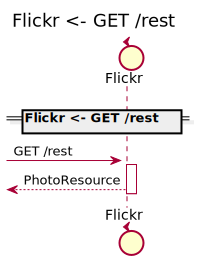

Request types

No Request types

#### Query Parameter

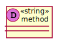

#### Query Parameter

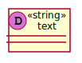

#### Query Parameter

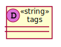

#### Query Parameter

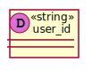

#### Query Parameter

#### Query Parameter

#### Query Parameter

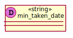

#### Query Parameter

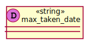

#### Query Parameter

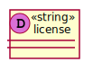

#### Query Parameter

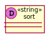

#### Query Parameter

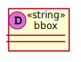

#### Query Parameter

#### Query Parameter

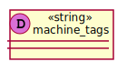

#### Query Parameter

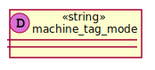

#### Query Parameter

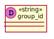

#### Query Parameter

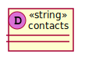

#### Query Parameter

#### Query Parameter

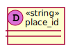

#### Query Parameter

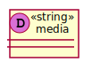

#### Query Parameter

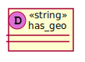

#### Query Parameter

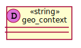

#### Query Parameter

#### Query Parameter

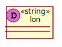

#### Query Parameter

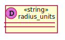

#### Query Parameter

#### Query Parameter

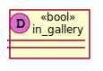

#### Query Parameter

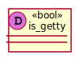

Response types

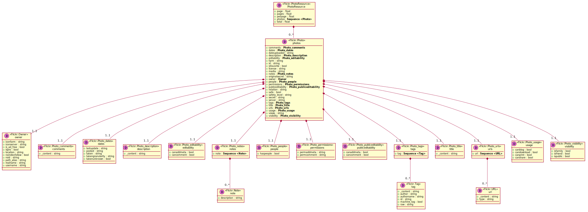

---

# Types

Flickr.Note

### Flickr.Note

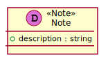

[Full Diagram](Flickr/note.svg)

#### Fields

| Field name | Type | Description |
|----|----|----|
| description | string | |

Flickr.Owner

### Flickr.Owner

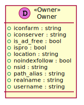

[Full Diagram](Flickr/owner.svg)

#### Fields

| Field name | Type | Description |
|----|----|----|
| iconfarm | string | |
| iconserver | string | |
| is_ad_free | bool | |
| ispro | bool | |
| location | string | |
| noindexfollow | bool | |
| nsid | string | |
| path_alias | string | |
| realname | string | |
| username | string | |

Flickr.Photo

### Flickr.Photo

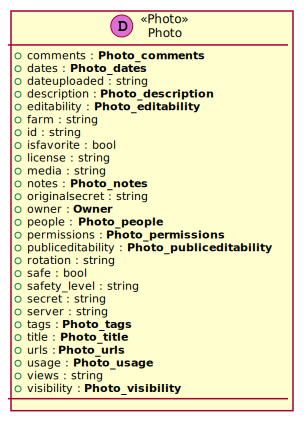

[Full Diagram](Flickr/photo.svg)

#### Fields

| Field name | Type | Description |
|----|----|----|
| comments | Photo_comments | |
| dates | Photo_dates | |
| dateuploaded | string | |
| description | Photo_description | |
| editability | Photo_editability | |
| farm | string | |
| id | string | |
| isfavorite | bool | |
| license | string | |
| media | string | |
| notes | Photo_notes | |
| originalsecret | string | |
| owner | Owner | |
| people | Photo_people | |
| permissions | Photo_permissions | |
| publiceditability | Photo_publiceditability | |
| rotation | string | |
| safe | bool | |
| safety_level | string | |
| secret | string | |
| server | string | |
| tags | Photo_tags | |
| title | Photo_title | |
| urls | Photo_urls | |
| usage | Photo_usage | |
| views | string | |
| visibility | Photo_visibility | |

Flickr.PhotoResource

### Flickr.PhotoResource

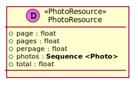

[Full Diagram](Flickr/photoresource.svg)

#### Fields

| Field name | Type | Description |
|----|----|----|
| page | float | |
| pages | float | |
| perpage | float | |
| photos | sequence of Photo | |
| total | float | |

Flickr.Photo_comments

### Flickr.Photo_comments

[Full Diagram](Flickr/photo_comments.svg)

#### Fields

| Field name | Type | Description |
|----|----|----|
| _content | string | |

Flickr.Photo_dates

### Flickr.Photo_dates

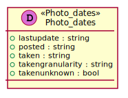

[Full Diagram](Flickr/photo_dates.svg)

#### Fields

| Field name | Type | Description |
|----|----|----|
| lastupdate | string | |
| posted | string | |
| taken | string | |
| takengranularity | string | |
| takenunknown | bool | |

Flickr.Photo_description

### Flickr.Photo_description

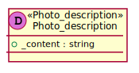

[Full Diagram](Flickr/photo_description.svg)

#### Fields

| Field name | Type | Description |
|----|----|----|
| _content | string | |

Flickr.Photo_editability

### Flickr.Photo_editability

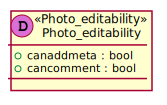

[Full Diagram](Flickr/photo_editability.svg)

#### Fields

| Field name | Type | Description |
|----|----|----|
| canaddmeta | bool | |
| cancomment | bool | |

Flickr.Photo_notes

### Flickr.Photo_notes

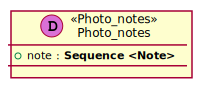

[Full Diagram](Flickr/photo_notes.svg)

#### Fields

| Field name | Type | Description |
|----|----|----|
| note | sequence of Note | |

Flickr.Photo_people

### Flickr.Photo_people

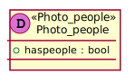

[Full Diagram](Flickr/photo_people.svg)

#### Fields

| Field name | Type | Description |
|----|----|----|
| haspeople | bool | |

Flickr.Photo_permissions

### Flickr.Photo_permissions

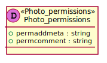

[Full Diagram](Flickr/photo_permissions.svg)

#### Fields

| Field name | Type | Description |
|----|----|----|
| permaddmeta | string | |
| permcomment | string | |

Flickr.Photo_publiceditability

### Flickr.Photo_publiceditability

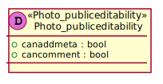

[Full Diagram](Flickr/photo_publiceditability.svg)

#### Fields

| Field name | Type | Description |
|----|----|----|
| canaddmeta | bool | |
| cancomment | bool | |

Flickr.Photo_tags

### Flickr.Photo_tags

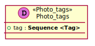

[Full Diagram](Flickr/photo_tags.svg)

#### Fields

| Field name | Type | Description |
|----|----|----|
| tag | sequence of Tag | |

Flickr.Photo_title

### Flickr.Photo_title

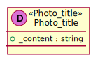

[Full Diagram](Flickr/photo_title.svg)

#### Fields

| Field name | Type | Description |
|----|----|----|
| _content | string | |

Flickr.Photo_urls

### Flickr.Photo_urls

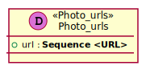

[Full Diagram](Flickr/photo_urls.svg)

#### Fields

| Field name | Type | Description |
|----|----|----|
| url | sequence of URL | |

Flickr.Photo_usage

### Flickr.Photo_usage

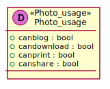

[Full Diagram](Flickr/photo_usage.svg)

#### Fields

| Field name | Type | Description |
|----|----|----|
| canblog | bool | |
| candownload | bool | |
| canprint | bool | |
| canshare | bool | |

Flickr.Photo_visibility

### Flickr.Photo_visibility

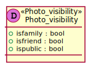

[Full Diagram](Flickr/photo_visibility.svg)

#### Fields

| Field name | Type | Description |
|----|----|----|
| isfamily | bool | |
| isfriend | bool | |
| ispublic | bool | |

Flickr.Tag

### Flickr.Tag

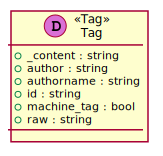

[Full Diagram](Flickr/tag.svg)

#### Fields

| Field name | Type | Description |
|----|----|----|
| _content | string | |
| author | string | |
| authorname | string | |
| id | string | |
| machine_tag | bool | |
| raw | string | |

Flickr.URL

### Flickr.URL

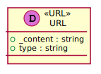

[Full Diagram](Flickr/url.svg)

#### Fields

| Field name | Type | Description |
|----|----|----|
| _content | string | |
| type | string | |

