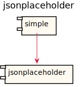
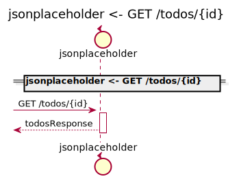
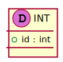
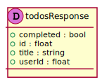

[Back](../README.md)

# jsonplaceholder

## Integration Diagram

## Application Index
| Application Name | Method | Source Location |
----|----|----
jsonplaceholder | [GET /todos/{id}](#jsonplaceholder-GETtodos{id}) | [../../api/jsonplaceholder.json](../../api/jsonplaceholder.json)|  

## Type Index
| Application Name | Type Name | Source Location |
----|----|----
jsonplaceholder | [todosResponse](#jsonplaceholder.todosResponse) | [../../api/jsonplaceholder.json](../../api/jsonplaceholder.json)|

# Applications

## Application jsonplaceholder

- No description.

### jsonplaceholder GETtodos{id}

Sequence Diagram

Request types

#### Request types

#### Path Parameter

Response types

#### Response types

---

# Types

jsonplaceholder.todosResponse

### jsonplaceholder.todosResponse

- 

[Full Diagram](jsonplaceholder/todosresponse.svg)

#### Fields

| Field name | Type | Description |
|----|----|----|
| completed | bool | |
| id | float | |
| title | string | |
| userId | float | |

