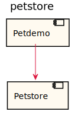
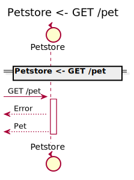
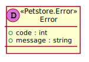
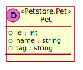
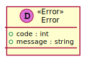
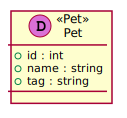

[Back](../README.md)

# petstore

## Integration Diagram

## Application Index

| Application Name | Method | Source Location |
|----|----|----|
| Petstore | [GET /pet](#Petstore-GETpet) | [https://github.com/anz-bank/sysl-template/blob/master/specs/backend/petstore/petstore.yaml](https://github.com/anz-bank/sysl-template/blob/master/specs/backend/petstore/petstore.yaml)|  

## Type Index

| Application Name | Type Name | Source Location |
|----|----|----|
| Petstore | [Error](#Petstore.Error) | [https://github.com/anz-bank/sysl-template/blob/master/specs/backend/petstore/petstore.yaml](https://github.com/anz-bank/sysl-template/blob/master/specs/backend/petstore/petstore.yaml)|
| Petstore | [Pet](#Petstore.Pet) | [https://github.com/anz-bank/sysl-template/blob/master/specs/backend/petstore/petstore.yaml](https://github.com/anz-bank/sysl-template/blob/master/specs/backend/petstore/petstore.yaml)|

# Applications

## Application Petstore

- No description.

### Petstore GET /pet

Sequence Diagram

Request types

No Request types

Response types

---

# Types

Petstore.Error

### Petstore.Error

[Full Diagram](Petstore/error.svg)

#### Fields

| Field name | Type | Description |
|----|----|----|
| code | int | |
| message | string | |

Petstore.Pet

### Petstore.Pet

[Full Diagram](Petstore/pet.svg)

#### Fields

| Field name | Type | Description |
|----|----|----|
| id | int | |
| name | string | |
| tag | string | |

