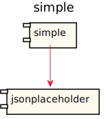
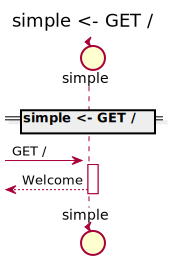
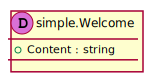
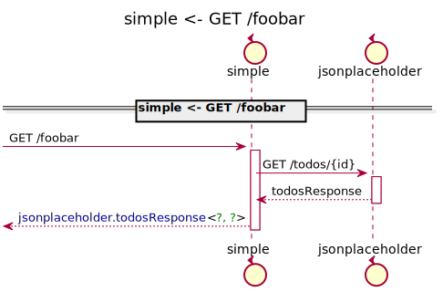
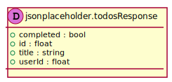
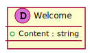

[Back](../README.md)

# simple

## Integration Diagram

## Application Index
| Application Name | Method | Source Location |
----|----|----
simple | [GET /](#simple-GET) | [../../api/project.sysl](../../api/project.sysl)|  
simple | [GET /foobar](#simple-GETfoobar) | [../../api/project.sysl](../../api/project.sysl)|  

## Type Index
| Application Name | Type Name | Source Location |
----|----|----
simple | [Welcome](#simple.Welcome) | [../../api/project.sysl](../../api/project.sysl)|

# Applications

## Application simple

- 

### simple GET

Sequence Diagram

Request types

#### Request types

Response types

#### Response types

---

### simple GETfoobar

Sequence Diagram

Request types

#### Request types

Response types

#### Response types

---

# Types

simple.Welcome

### simple.Welcome

- 

[Full Diagram](simple/welcome.svg)

#### Fields

| Field name | Type | Description |
|----|----|----|
| Content | string | |

